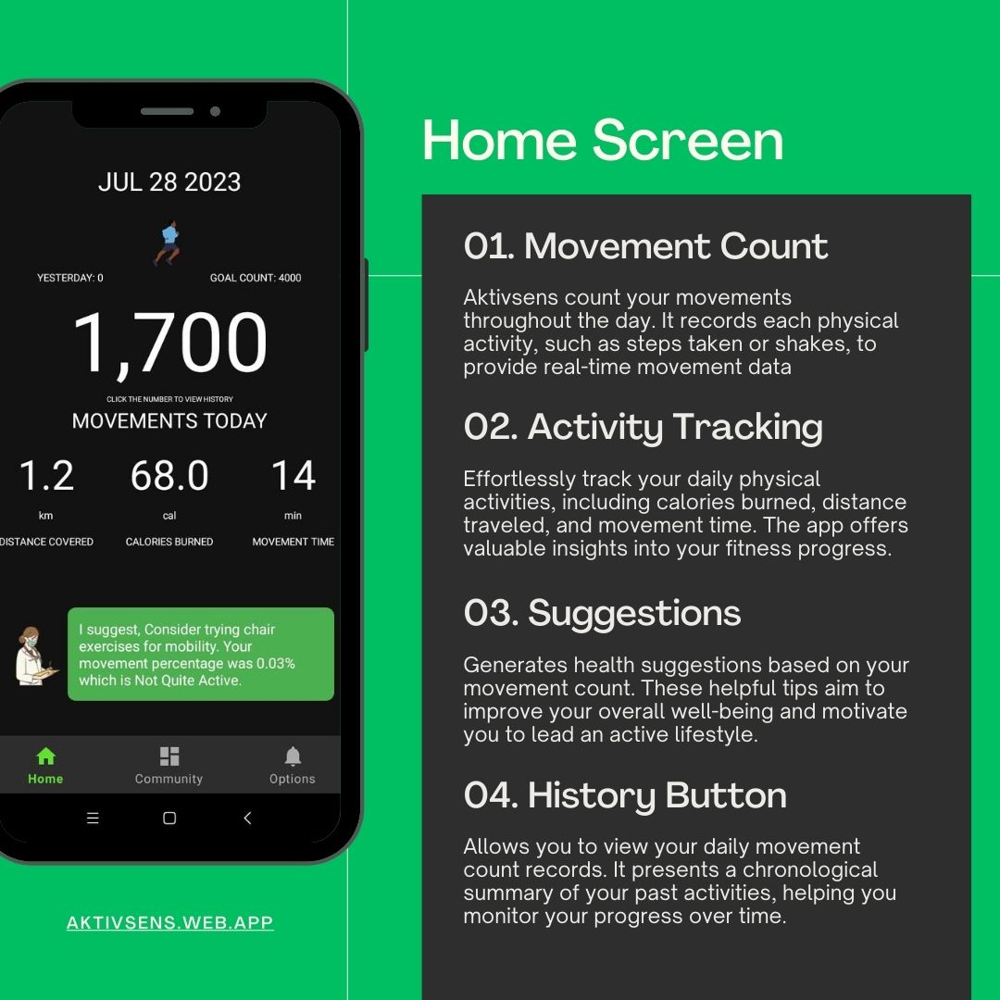
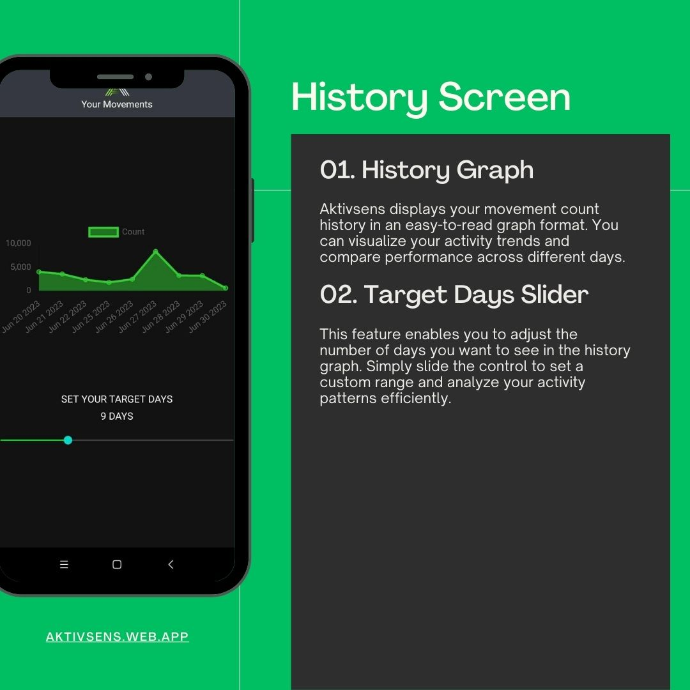
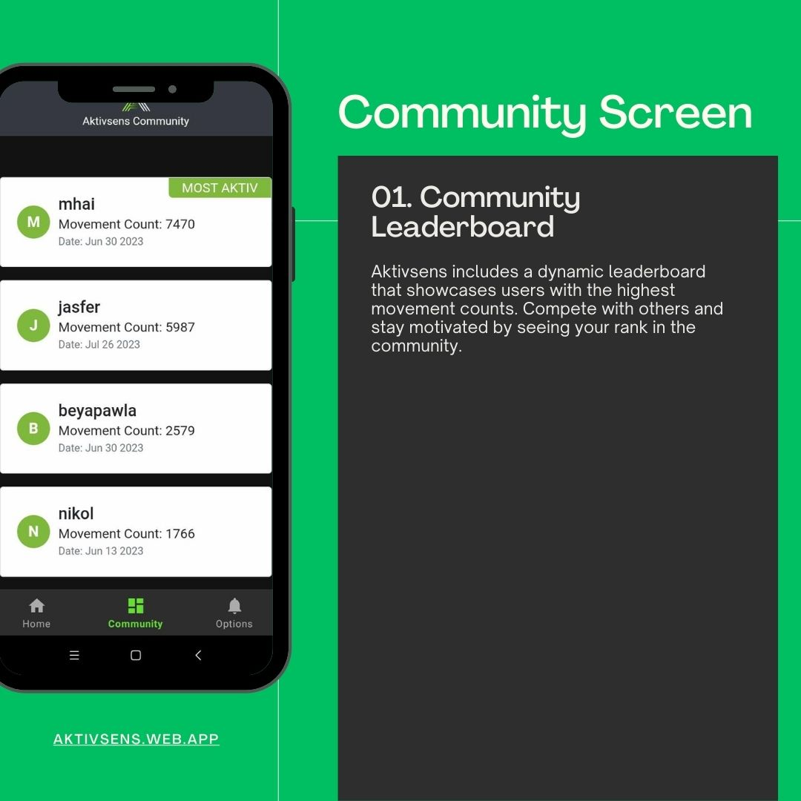
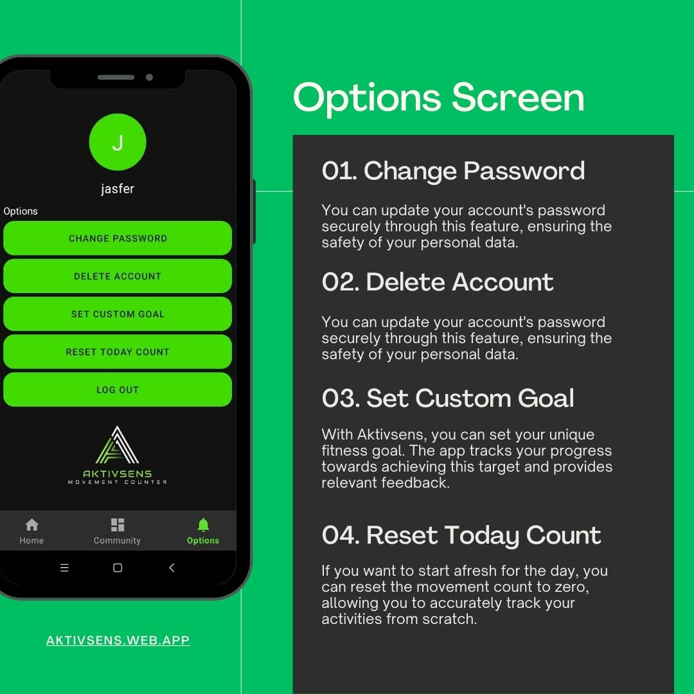

# Aktivsens: Movement Counter
This project is created as an educational requirement for the subject Mobile Application of BS Information Technology 3B.

Welcome to Aktivsens, your personal companion on the journey to a more active and fulfilling life. Track, Analyze, and Thrive! Join us today and experience the thrill of becoming the best version of yourself. It's time to embrace the endless possibilities that await you with Aktivsens!
## Overview
Aktivsens is an innovative Android application that employs accelerometer-based assistive technology to empower visually impaired individuals in monitoring and enhancing their physical activity. This study delves into the app's development, testing, and evaluation to explore its potential benefits and implications for visually impaired users. By utilizing existing datasets, enhancing and adding trained datasets, and employing Firebase as the main database engine, Aktivsens offers a comprehensive solution to track daily movements, compute approximate burned calories, movement time, and distance traveled. Moreover, its community leaderboard fosters a sense of community engagement and motivation. In this overview, we present a brief summary of the app's functionalities and its potential impact on the visually impaired community.
## Features

## Demo
Watch the demo video [here](https://drive.google.com/file/d/15YcS2YYGzQ356mYxV7AtHB3iqMnwmUZ8/view?usp=sharing).

## Download
Download APK file [here](https://aktivsens.web.app/).

## Requirements
* Optimized for Android 11 and below
* Android Studio (for debugging)
* Internet Connection

## Researcher/Developer:
* De Veyra, Jasfer E
* Grefalda, Remy
* Agustin, Nicole
* Año, Beatrice Paola

## Adviser:
* Jefferson A. Costales

## School Name:
Eulogio "Amang" Rodriguez Insitute of Science and Technology

Nagtahan, Sampaloc, Manila, Philippines

College of Arts and Sciences

ITE Department

## Course:
Bachelor of Science in Information Technology

## Date:
July 29, 2023
